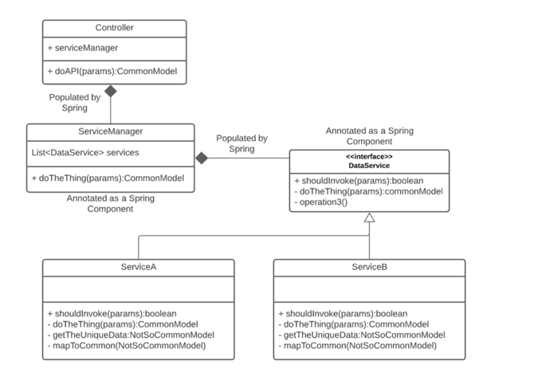

# Pizza App

## Running the application locally

Most Java IDEs have a way to run a Spring Boot application on your local machine

### Visual Studio Code

Install the `Java Extension Pack` extension, and open project directory. Clicking Run > Start Debugging (F5) should present a dialog box prompting for the profile you which to run (defaulting to local). Hit enter and the application should start.

### IntelliJ

* Open or import -> Navigate to folder containing `pom.xml`
* Choose to open as `Maven Project` if prompted

### STS / Eclipse

* File -> Import -> Existing Maven Project -> Navigate to the folder containing `pom.xml`
* Choose the Spring Boot Application file (search for @SpringBootApplication)
* Right Click on the file and Run as Java Application

### Command line

You can use the [Spring Boot Maven plugin](https://docs.spring.io/spring-boot/docs/current/reference/html/build-tool-plugins-maven-plugin.html) as such:


```shell
mvn spring-boot:run
```
### Postman Collection

you can find the postman collection in the folder collection/postman_collection.json

#### List of Endpoints Order

* POST `api/order`   - Create a new order 
  * body request: 
    ```json
    {
        "typePizza": "string"
    }
    ```

  * body response:
      ```json
      {
        "id": uuid,
        "pizza": {
          "name": "string",
          "ingredients": [
            "string"
        ]
    },
    "status": "string",
    "message": "string",
    "checked": "string"
      }
      ```
    


#### List of Endpoints Inventory
* GET `api/inventory/products`   - Get all inventory
* POST `api/inventory/products`   - Create a new product
  * body: 
    ```json
    {
        "name": "string",
        "quantity": 0
    }
    ```
* PUT `api/inventory/products/{name}/increase/{value}`   - Increase the quantity of a product
* PUT `api/inventory/products/{name}/decrease/{value}`   - Decrease the quantity of a product


### Technical Design Pizza Store

* Controller to handle the order and the inventory, the order controller is responsible to create a new order and the inventory controller is responsible to handle the inventory.
* Processor to handle the business logic, the processor is responsible to handle the business logic of the order and the inventory.
* Service to handle the database (emulate json File), the service is responsible to handle the database of the order and the inventory.
* PizzaManager to handle the pizza available, you can create new Pizzas adding a new class `extends Pizza implements IPizza` and add new enum to the `TypePizza` enum to add new pizza to the store.
* The inventory will be updated based on the ingredients of the pizza.
* If the inventory is not enough to create the pizza, the order will be rejected.
* file `src/main/resources/stock.json` is the database of the application, you can find the inventory.

### Service Manager Explanation
The Service Manager maintains a list of all of the subject services and exposes a method that receives the request parameters from the API and interrogates the services serially to find one that responds that it is the right one for this request.  This service is then returned.

